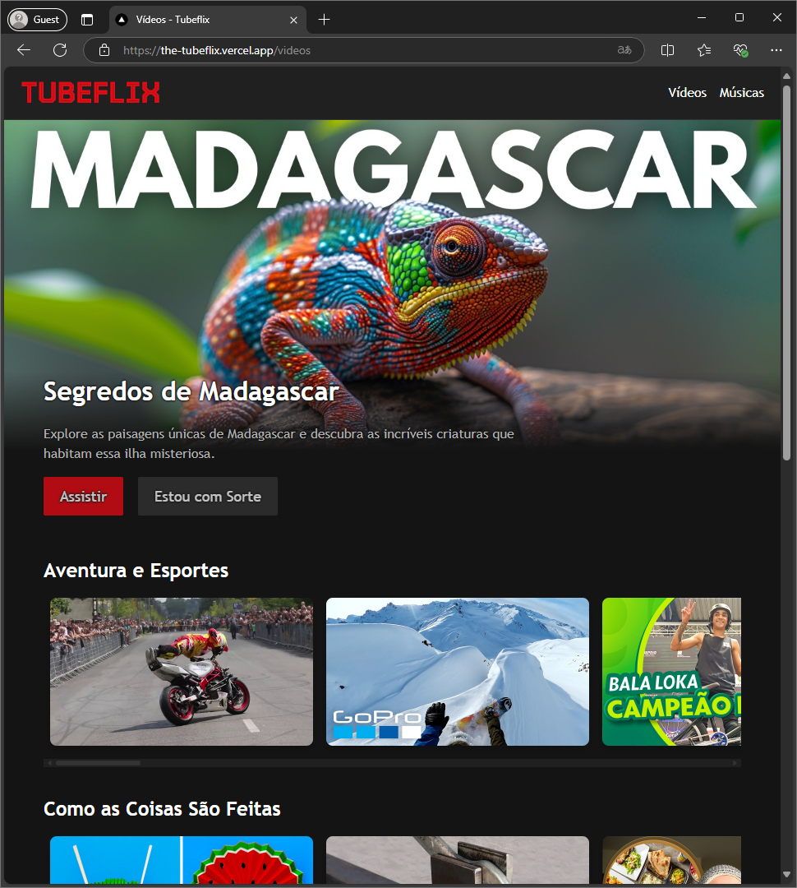

# 🎬 Tubeflix

## Sobre o projeto

**Tubeflix** é uma aplicação desenvolvida com **Next.js**, que combina o design inspirado na Netflix com a funcionalidade de exibir vídeos do YouTube. Este projeto serve como um exemplo prático e moderno de como construir aplicações React, utilizando as funcionalidades mais recentes do **Next.js**.  

## Demonstração

- 🔗 **Acesse o app online:** [https://the-tubeflix.vercel.app/](https://the-tubeflix.vercel.app/)

- **Tela inicial do app**:

    

## Funcionalidades

- **Visualização e reprodução de conteúdo**: Permite exibir e reproduzir vídeos do YouTube em um layout similar ao Netflix.
- **Navegação e organização**: Permite explorar vídeos por categorias com uma grade dinâmica e responsiva.
- **Base de dados personalizável:**: Possibilita modificar facilmente a base de vídeos por meio do arquivo `/src/data/database.json`.
- **Alternância de tema**: Suporte para alternar entre os modos claro e escuro.
- **Página de erro personalizada:**: Apresenta uma interface personalizada para rotas não encontradas (404).

## Tecnologias

[](https://nextjs.org)
[](https://turbo.build/pack)
[](https://reactjs.org)
[](https://github.com/troybetz/react-youtube)
[](https://react.dev/reference/react-dom)
[](https://eslint.org)

## Instalação e execução

### Pré-requisitos

Certifique-se de ter o **Node.js** (versão 14 ou superior) instalado em sua máquina. O npm (Node Package Manager) é incluído automaticamente com a instalação do Node.js.

### Passos para execução

1. **Clone o repositório**:

   ```bash
   git clone https://github.com/marcelomduarte/javascript_nextjs_tubeflix.git
   ```

2. **Acesse o diretório**:

   ```bash
   cd javascript_nextjs_tubeflix
   ```

3. **Instale as dependências**:

   ```bash
   npm install
   ```

4. **Inicie o servidor de desenvolvimento**:

   ```bash
   npm run dev
   ```

5. **Acesse a aplicação Web no navegador**:

    Abra seu navegador e navegue para `http://localhost:3000` para explorar o Tubeflix.

### Build para produção

Para gerar uma versão otimizada do aplicativo para deployment em produção, execute o comando de build. Os arquivos estáticos serão gerados na pasta `.next` (padrão do Next.js).

```bash
npm run build
```

### Executar em produção (localmente)

Após o build, você pode iniciar o servidor em modo de produção localmente:

```bash
npm start
```

## Estrutura do projeto

```text
javascript_nextjs_tubeflix/
├── .next/
├── node_modules/
├── public/
│   ├── 404-background.png
│   └── opengraph.webp
├── src/
│   ├── app/
│   │   ├── api/
│   │   │   ├── video/
│   │   │   │   ├── [youtubeId]/
│   │   │   │   │   └── route.js
│   │   │   └── videos/
│   │   │       └── route.js
│   │   ├── musics/
│   │   │   ├── page.js
│   │   │   └── page.module.css
│   │   ├── player/
│   │   │   ├── [youtubeId]/
│   │   │   │   ├── page.js
│   │   │   │   └── page.module.css
│   │   ├── videos/
│   │   │   ├── page.js
│   │   │   └── page.module.css
│   │   ├── favicon.ico
│   │   ├── globals.css
│   │   ├── layout.js
│   │   ├── layout.module.css
│   │   ├── not-found.js
│   │   ├── not-found.module.css
│   │   ├── page.js
│   │   ├── page.module.css
│   │   └── theme.css
│   ├── components/
│   │   ├── HighlightVideo.js
│   │   ├── HighlightVideo.module.css
│   │   ├── ThemeToggle.js
│   │   ├── ThemeToggle.module.css
│   │   ├── VideoList.js
│   │   ├── VideoList.module.css
│   │   ├── VideoTags.js
│   │   ├── VideoTags.module.css
│   │   ├── VideoThumb.js
│   │   ├── VideoThumb.module.css
│   │   └── YoutubeVideoThumb.js
│   ├── contexts/
│   │   └── ThemeContext.js
│   ├── data/
│   │   └── database.json
│   ├── fonts/
│   │   └── tourney.woff2
│   ├── helpers/
│   │   ├── helpers-server.js
│   │   └── helpers.js
├── .eslintrc.json
├── .gitignore
├── jsconfig.json
├── next.config.mjs
├── package-lock.json
├── package.json
└── README.md
```
